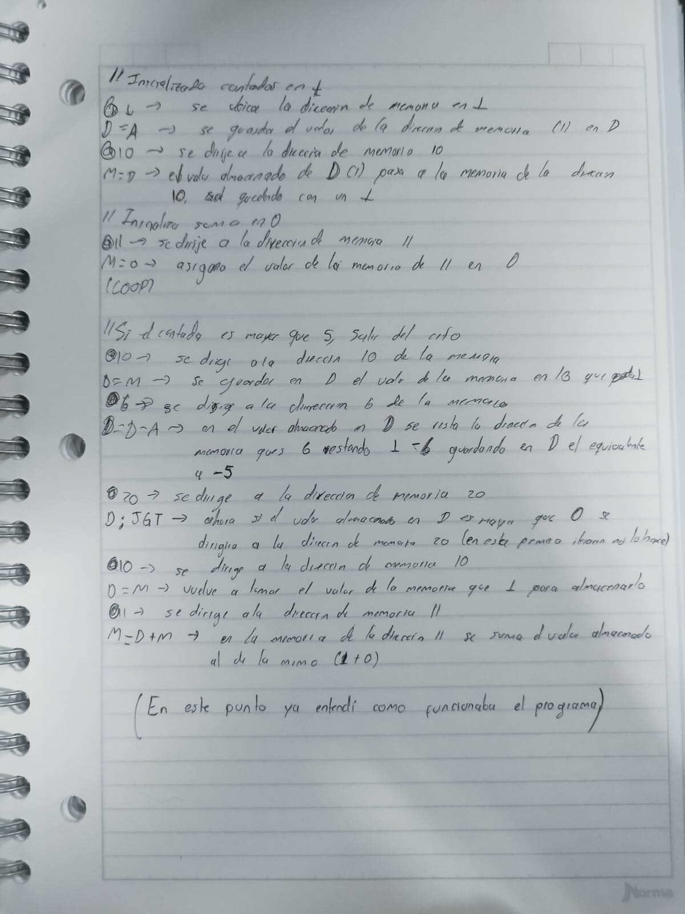

# Actividad 5: Implementando un ciclo simple

## Objetivo
Crear un programa que utilice un ciclo para sumar los números del 1 al 5 y almacenar el resultado final en la dirección de memoria 12.

## Descripción del problema
El programa debe:
- Inicializar un contador que vaya desde 1 hasta 5.
- Acumular la suma de estos valores.
- Guardar el resultado final en la dirección de memoria 12.

---

## Metodología de simulación

### 1. Predicción
Se espera que el programa sume los valores 1 + 2 + 3 + 4 + 5 y almacene el resultado, que es 15, en la dirección de memoria 12.

### 2. Ejecución
El programa usa un ciclo controlado por un contador. En cada iteración, el valor del contador se suma a un acumulador y luego el contador se incrementa.

### 3. Observación
Se observa cómo el valor acumulado aumenta en cada iteración del ciclo hasta que el contador supera el valor límite.

### 4. Reflexión
El uso de ciclos permite repetir instrucciones sin necesidad de escribirlas múltiples veces, haciendo el programa más eficiente y escalable.

Pedi ayuda a la inteligencia artificial en la elaboracion, seguido a esto analice cada paso hasta entender como funciona el programa anotandolo en un cuaderno paso por paso.

