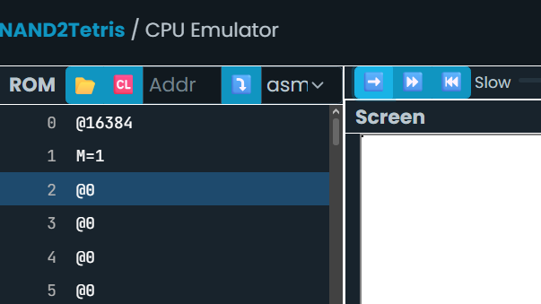

# Actividad 1  
## Dibujando un punto en la pantalla (Hack)

---

## 1. Programa en lenguaje ensamblador (Hack)

## 3. Simulación paso a paso (metodología)
### 3.1 Predicción

En el lenguaje ensamblador espero que se dibuje un pixel negro en la esquina superior izquierda de la pantalla, mientras que en el programa en `c++` al ser solo una representacion de la memoria de 16 bits no se espera que suceda algo al ejecutarlo

### 3.2 Ejecución

Solo son 2 instrucciones que ambas son relevantes que son el ubicarnos en la posicion de memoria `@16384` y luego en esa posicion cambiar su valor a `1` lo que hace que se dibuje un pixel negro en la pantalla.

### 3.3 Observación

Al ejecutar el programa ocurrio precisamente lo que esperaba, que se dibujara un pixel en la esquina superior izquierda al modificar el valor de memoria a `1` en esa dirección de memoria.

### 3.4 Reflexión

Al desarrollar la actividad no se me presento mayor complicación, sucedio lo que esperaba.